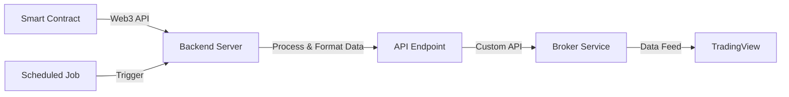

To get the data from this smart contract into TradingView via a broker, you'll need to create a pipeline that bridges the gap between the blockchain and TradingView. Here's a high-level overview of how you could approach this:



Here's a detailed explanation of each step:

1. Smart Contract Interaction:
   - Set up a backend server that can interact with the Gnosis blockchain.
   - Use a Web3 library (like web3.js or ethers.js) to call the smart contract's data retrieval functions.

2. Backend Server:
   - Create a server (using Node.js, Python, etc.) that periodically fetches data from the smart contract.
   - Process and format the data into a structure that's compatible with TradingView.

3. API Endpoint:
   - Expose the processed data through a RESTful API endpoint.
   - This API should be able to serve historical data and potentially stream real-time updates.

4. Broker Integration:
   - Work with a broker that supports custom data integration with TradingView.
   - The broker will need to set up a system to regularly pull data from your API and format it according to TradingView's requirements.

5. TradingView Custom Data Feed:
   - The broker will provide you with a custom symbol that represents your data in TradingView.
   - Users can then access this symbol like any other data feed in TradingView.

Here's some sample code for the backend server to interact with the smart contract:

```javascript
const Web3 = require('web3');
const contractABI = require('./contractABI.json');

const web3 = new Web3('https://rpc.gnosischain.com'); // Gnosis RPC endpoint
const contractAddress = '0x1234...'; // Your deployed contract address
const contract = new web3.eth.Contract(contractABI, contractAddress);

async function fetchLatestData(userAddress) {
    const latestBlock = await web3.eth.getBlockNumber();
    const oneHourAgo = Math.floor(Date.now() / 1000) - 3600;
    
    const result = await contract.methods.getDataPoints(userAddress, oneHourAgo, latestBlock).call();
    
    // Process the result into the format expected by your API
    const processedData = result.map((dataPoint, index) => ({
        timestamp: result.filteredTimestamps[index],
        integerValue: result.integerValues[index],
        floatValue: result.floatValues[index] / 1e18 // Convert from fixed-point
    }));
    
    return processedData;
}
```

This is a Solidity smart contract that provides a way to store and retrieve trading data. Here's an overview of what it does:

1. `SPDX-License-Identifier` - This indicates the license under which this code is distributed. In this case, it is MIT (MIT License).

2. Pragma statement - It specifies the version of Solidity compiler to use with this contract. The caret symbol means "compatible with".

3. Import statements - These import OpenZeppelin libraries for access control, pausability, and safe math operations.

4. Roles (ADMIN_ROLE, WRITER_ROLE, READER_ROLE) - Access roles are defined using the keccak256 hash of role names.

5. DataPoint Struct - This is a struct that contains an integer value, float value represented as fixed-point number with precision up to 18 decimal places (represented by dividing by 1e18), and timestamp for each data point.

6. Mappings - Two mappings are defined: one mapping from users to their data points and another from users to a list of timestamps.

7. Events - An event named `DataPointAdded` is emitted whenever a new data point is added.

8. Constructor - The constructor assigns the contract's creator to both ADMIN_ROLE and DEFAULT_ADMIN_ROLE roles via the OpenZeppelin AccessControl library.

9. Functions:
    - `addDataPoint` allows a user with WRITER_ROLE role to add a new data point to their record within specified float value range (-1e18 to 1e18). It also records the timestamp of addition and emits a DataPointAdded event.

    - `getDataPoint` returns an integer and float values for a specific user at a given timestamp if it exists, requiring READER_ROLE access.

    - `getDataPoints` returns arrays of integer and float values (as well as timestamps) for all data points in a specified range for a given user, also requiring the READER_ROLE access.

    - The contract is paused and unpaused by an ADMIN_ROLE account using OpenZeppelin's Pausable library.

    - `grantRole` and `revokeRole` functions allow the admin to grant or revoke roles from any address.

This smart contract provides a secure, permissioned way of storing and retrieving trading data on blockchain for authorized users only. It is useful in cases where real-time market data needs to be stored, accessed, and controlled by trusted parties while still providing transparency to all participants.
